# Title

Predicting NBA Postseason Depth from Regular-Season Team and Rotation Statistics Using Deep Learning

Pranav Kumar Kaliaperumal, Shrujal Mogadati, and Disha Srinivasa
Department of Computer Science, University of Colorado Denver, Denver, CO 80217 USA
Project repository: [GitHub repository](https://github.com/shrujalm/CSCI-5952-Deep-Learning-Semester-Project-Mogadati-Kaliaperumal-Srinivasa)

*Keywords*: NBA, sports analytics, deep learning, attention mechanism, player embeddings, postseason prediction, class imbalance, machine learning

# Problem Statement

Our work asks whether regular-season team performance, roster context, and rotation-level player statistics can forecast how far an NBA team eventually advances in the postseason. We frame the task as a six-class classification problem. Each team-season receives one final playoff-depth label: Missed Playoffs, First Round Exit, Second Round Exit, Conference Finals, Finals Loss, or Champion. This formulation preserves distinctions that a binary playoff or championship target would erase. A lottery team, a first-round team, a conference finalist, and a champion occupy different basketball realities.

We evaluate 21 NBA seasons, from 2003-04 through 2023-24, for a total of 629 team-seasons. Each row represents one team in one season, and each label records that team's deepest postseason round. To make the experiment realistic, our project uses leave-one-season-out cross-validation. For each fold, we train on every season except one and test on the held-out season. The design asks a demanding question: can the model generalize to a future season, rather than simply recognize patterns from randomly mixed team rows?

The task brings three major difficulties. First, regular-season statistics do not fully determine playoff success. Matchups, injuries, coaching adjustments, trades, and late-season form can all reshape a team's path. Second, the dataset is small for deep learning. We receive only 30 team examples per season, and each season contains exactly one champion. Third, the labels are highly imbalanced: 293 team-seasons miss the playoffs, while only 21 win the championship and 21 lose in the Finals.

# Motivation

We chose this problem because playoff-depth forecasting sits at the intersection of basketball strategy and machine learning. Teams, analysts, broadcasters, and fans routinely ask whether a team is merely strong in the regular season or genuinely built for the playoffs. A useful model could support trade-deadline planning, roster evaluation, media analysis, fan engagement, ticketing decisions, and sponsorship planning [1]. Our project does not treat the model as a betting system or as a substitute for expert scouting. We treat it as a decision-support tool that helps clarify which statistical signals tend to travel from the regular season into the postseason.

The project also tests a modeling question that matters beyond basketball. Much of the existing NBA prediction literature focuses on individual game outcomes or binary playoff qualification, and many strong systems rely on traditional tabular models [2]-[5]. We ask whether a roster-aware neural model can add value when it sees the top eight rotation players explicitly. Basketball is not only a team-average sport. Two teams can post similar net ratings while differing sharply in star power, shooting depth, defensive balance, and bench reliability. Our attention model therefore learns how much influence to assign to each rotation slot before forming a team-level postseason prediction.

We also include a mid-season extension because many consequential decisions happen before the regular season ends. In that setting, our project uses statistics available around season-specific All-Star-break proxy dates while keeping the final postseason outcome as the label. The experiment asks whether our workflow can forecast playoff depth when teams still have time to trade, rest players, adjust rotations, or change strategic direction.

Ethical framing belongs inside the project, not beside it. We use performance statistics instead of player demographics, race, nationality, salary, endorsement value, or media popularity. Even so, team-level sports data can reflect structural advantages, including market size, organizational resources, media exposure, and free-agency appeal. For that reason, our work includes a market-size fairness audit and treats predictions as decision-support signals, not as final judgments about players, teams, cities, fan bases, or organizational worth.

# Related Works

Sports prediction research often follows two paths: game-level outcome prediction and season-level team evaluation. Khanmohammadi et al. [1] proposed MambaNet, a hybrid neural network that uses team and player time-series data to predict NBA playoff games, reporting AUC values from 0.72 to 0.82. Zhao et al. [2] combined a fused graph convolutional network with a random forest model for basketball game outcome prediction, which motivates graph and interaction-aware structure even though our project works with season-level team rows. Ouyang et al. [4] paired XGBoost with SHAP explanations for NBA game outcomes, while Rios et al. [5] applied long-sequence LSTMs to NBA game prediction. These studies show that machine learning can model basketball outcomes, though their main focus remains game prediction rather than season-level playoff depth.

Representation learning provides another foundation for our project. Guan et al. [3] introduced NBA2Vec, which learns dense player representations from play outcomes rather than relying only on hand-crafted aggregate measures. Ibrahim et al. [6] and Teno et al. [7] studied season-level basketball prediction with machine learning and showed that championship and playoff-stage forecasting is feasible, but hard. Teno et al. specifically evaluate NBA game outcomes and playoff or championship stages across 10 seasons. Bunker and Thabtah [8] survey sport result prediction and explain why sports forecasting matters as a practical decision-support problem. Yeung [9] reports strong random forest performance for NBA playoff qualification, and Perricone et al. [10] show that NBA API data can support competent basketball outcome models.

Our work also draws on class-imbalance and interpretability research. Chawla et al. [12] introduced SMOTE, Elreedy and Atiya [13] analyzed SMOTE variants, and He et al. [14] proposed ADASYN. We do not use synthetic oversampling in our main experiments because leave-one-season-out validation makes cross-season sample synthesis risky. Still, these methods explain why the rare Champion and Finals Loss classes are so difficult. Vaswani et al. [15] introduced attention mechanisms, which inspire our roster-weighting architecture. Explainable sports analytics work, including Ouyang et al. [4] and Wang et al. [11], also informs our attention diagnostics and our caution that learned weights support interpretation rather than causal claims.

Our project sits between these threads. We use real NBA data, retain six playoff-depth labels, compare classical and neural models, validate by held-out season, inspect attention-based roster weights, audit market-size error, and evaluate both full-season and mid-season forecasting.

# Methods

## Data

We collect NBA data through the `nba_api` Python library [16], which exposes NBA.com statistics endpoints. For each season from 2003-04 through 2023-24, our pipeline assembles team box-score data, advanced team efficiency metrics, and player statistics. The full-season processed dataset is stored in `data/processed/features_research.csv`, and the mid-season processed dataset is stored in `data/processed/features_midseason.csv`. Both files contain 629 rows and 112 columns.

Our unit of analysis is the team-season. We keep metadata columns for `SEASON`, `TEAM`, `TEAM_ID`, `PLAYOFF_RESULT`, and `PLAYOFF_LABEL`, then add team, context, and player features. We begin in 2003-04 because that season gives us a modern multi-season sample with relatively consistent team and player statistics. We stop in 2023-24 because it is the most recent completed season in our committed artifacts, so every label is final.

For full-season forecasting, we use complete regular-season statistics. For mid-season forecasting, we use the same schema but filter team and player statistics to season-specific All-Star-break proxy cutoffs, following the pipeline described in `docs/midseason_report.md`. The target label stays unchanged in both settings. As a result, the mid-season task asks a harder and more practical question: how much can our model infer about final playoff depth before the regular season has finished?

## Labels

We define six ordered playoff-depth labels:

| Class | Outcome | Count | Share |
| ---: | --- | ---: | ---: |
| 0 | Missed Playoffs | 293 | 46.6% |
| 1 | First Round Exit | 168 | 26.7% |
| 2 | Second Round Exit | 84 | 13.4% |
| 3 | Conference Finals | 42 | 6.7% |
| 4 | Finals Loss | 21 | 3.3% |
| 5 | Champion | 21 | 3.3% |

We preserve the ordered playoff-depth scale because it carries richer basketball meaning than a binary target. A second-round team and a champion are both playoff teams, but they imply different roster quality, strategic urgency, and championship probability. We also report macro F1 because accuracy alone can hide weak performance on rare labels such as Finals Loss and Champion.

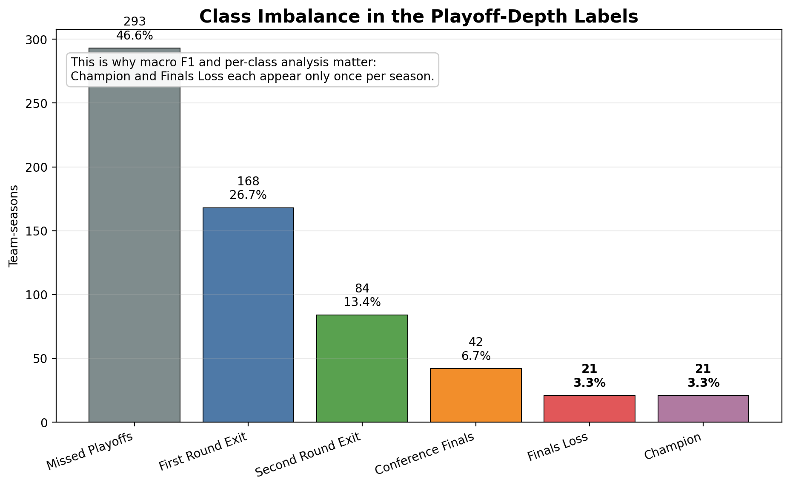

Figure 1. Label counts for the six playoff-depth classes. The imbalance is severe: missed-playoff teams dominate the dataset, while champions appear only once per season. The figure comes from the processed feature artifacts and the label counts summarized in `docs/real_results_summary.md`.

## Features

Our feature set has three groups. First, we use team-level regular-season performance variables, including wins, losses, win percentage, points, rebounds, assists, steals, blocks, turnovers, field-goal percentage, three-point percentage, free-throw percentage, plus/minus, offensive rating, defensive rating, net rating, and pace. These variables capture team strength and playing style.

Second, we add contextual variables. A conference-strength proxy helps the model account for season-specific Eastern and Western Conference conditions. We also include roster continuity, since a stable rotation may make regular-season performance more predictive than a roster assembled late through trades or disrupted by injuries.

Third, our project represents the top eight rotation players by minutes played. For slots P1 through P8, we include production and efficiency variables such as points, rebounds, assists, steals, blocks, minutes, shooting efficiency, and an approximate PER-style impact summary. This fixed roster representation lets every model see not only how the team performed overall, but also how production was distributed across the rotation.

We standardize numeric features inside each training fold so that held-out seasons do not leak into preprocessing. The full-season and mid-season datasets use identical feature schemas, which lets us compare performance changes directly.

## Models

We compare four models:

| Model | Purpose in our project |
| --- | --- |
| Logistic Regression | A simple linear baseline with interpretable class boundaries. |
| Random Forest | A strong non-linear tabular baseline that handles feature interactions well. |
| MLP Baseline | A neural baseline over the flattened feature vector. |
| Attention Model | Our roster-aware neural model with learned weights over the top-eight player slots. |

The attention model separates team and context features from player-slot features. It projects each player slot into a learned representation, computes attention weights across the eight slots, pools the weighted roster representation, and concatenates that pooled vector with the team/context vector before classification. This architecture lets our project test whether explicit roster structure improves forecasting. It also yields an interpretable artifact: learned attention weights by rotation slot.

We train neural models with Adam at a learning rate of 0.001. The committed full-season and mid-season runs use 150 epochs for the MLP baseline and 200 epochs for the attention model, with random seed 42. We keep hyperparameter search lightweight because the dataset is small and season-level overfitting is a serious risk.

## Validation And Evaluation

Our project uses leave-one-season-out cross-validation for both the full-season and mid-season settings. In each fold, we hold out one NBA season, train on all remaining seasons, fit preprocessing only on the training fold, and evaluate on the held-out season. We then aggregate out-of-fold predictions across all 629 team-seasons.

We report exact accuracy, macro F1, and top-2 accuracy. Exact accuracy measures whether the model predicts the precise playoff-depth class. Macro F1 gives equal weight to every class, which exposes rare-class failures that accuracy can mask. Top-2 accuracy measures whether the true label appears among the model's two most likely classes. That metric matters here because adjacent playoff-depth labels can be hard to separate while still supporting useful tier-based decisions.

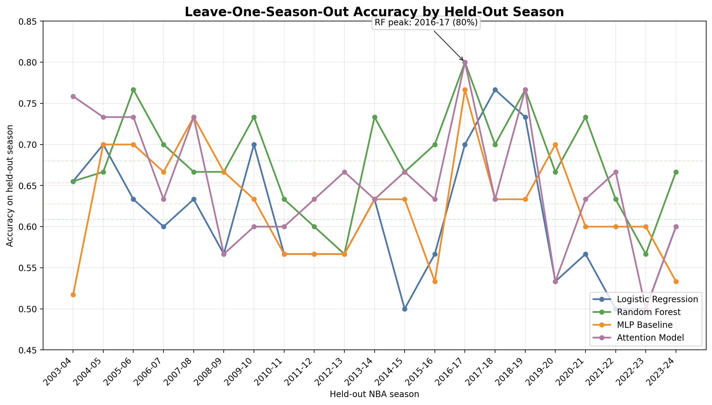

Figure 2. Fold accuracy across held-out seasons. Performance changes substantially from year to year, which reinforces the value of season-level validation. The plot is generated from `results/research_study/fold_metrics.csv`.

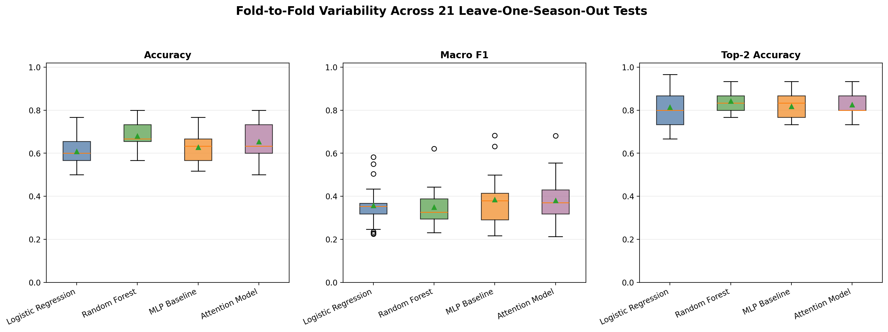

Figure 3. Season-to-season variability in validation metrics. The boxplot makes the instability of a small seasonal dataset visible and is based on the fold-level metrics under `results/research_study/`.

## Results

Our full-season experiment shows that the task is learnable, but far from solved. Random Forest achieves the best exact accuracy at 68.0% and the best top-2 accuracy at 84.3%. The MLP baseline achieves the best macro F1 at 40.8%, suggesting that it handles minority classes slightly better overall. The attention model reaches 65.3% accuracy, 39.3% macro F1, and 82.5% top-2 accuracy while also producing attention-weight diagnostics.

| Model | Accuracy | Accuracy Mean +/- SD | Macro F1 | Top-2 Accuracy |
| --- | ---: | ---: | ---: | ---: |
| Logistic Regression | 60.9% | 60.9% +/- 7.6% | 38.0% | 81.4% |
| Random Forest | 68.0% | 68.0% +/- 6.1% | 36.2% | 84.3% |
| MLP Baseline | 62.8% | 62.8% +/- 6.6% | 40.8% | 81.7% |
| Attention Model | 65.3% | 65.4% +/- 7.6% | 39.3% | 82.5% |

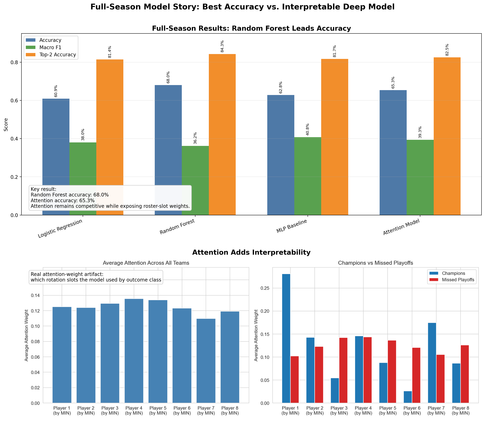

Figure 4. Comparison between the strongest full-season accuracy model, Random Forest, and our interpretable Attention Model. The metrics come from `results/research_study/model_comparison.csv`.

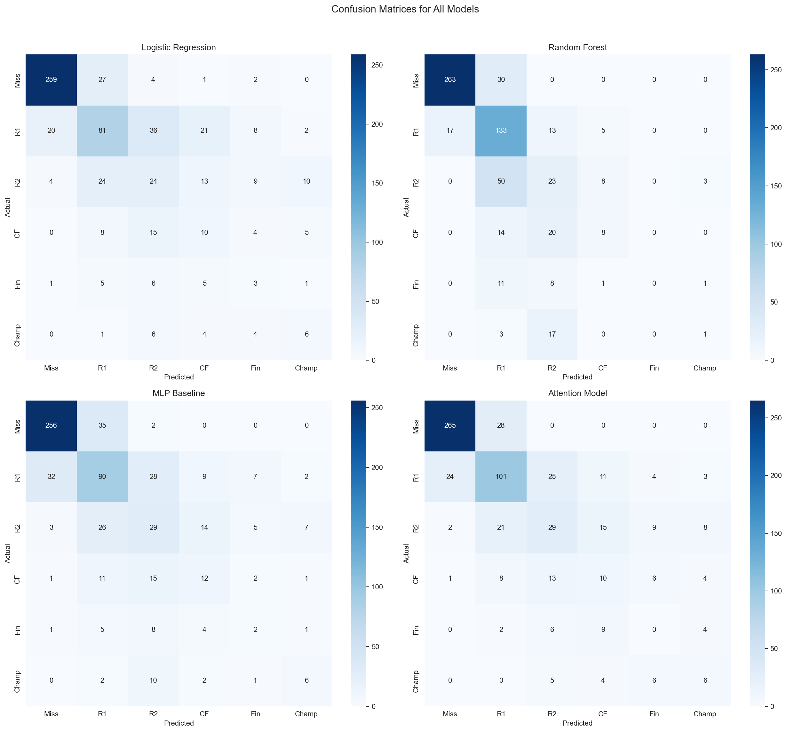

Figure 5. Full-season confusion matrices for the evaluated models. Errors cluster around neighboring playoff-depth classes, which is consistent with the ordered structure of the labels. The matrices use the out-of-fold predictions in `results/research_study/predictions.csv`.

The full-season attention model performs best on Missed Playoffs, with precision 0.908, recall 0.904, and F1 0.906. It reaches F1 0.616 on First Round Exit and 0.358 on Second Round Exit, but the rarest labels remain difficult. In this run, the model scores F1 0.000 on Finals Loss and F1 0.261 on Champion. A single finalist and champion per season create a steep rare-class learning problem.

| Class | Precision | Recall | F1 | Support |
| --- | ---: | ---: | ---: | ---: |
| Missed Playoffs | 0.908 | 0.904 | 0.906 | 293 |
| First Round Exit | 0.631 | 0.601 | 0.616 | 168 |
| Second Round Exit | 0.372 | 0.345 | 0.358 | 84 |
| Conference Finals | 0.204 | 0.238 | 0.220 | 42 |
| Finals Loss | 0.000 | 0.000 | 0.000 | 21 |
| Champion | 0.240 | 0.286 | 0.261 | 21 |

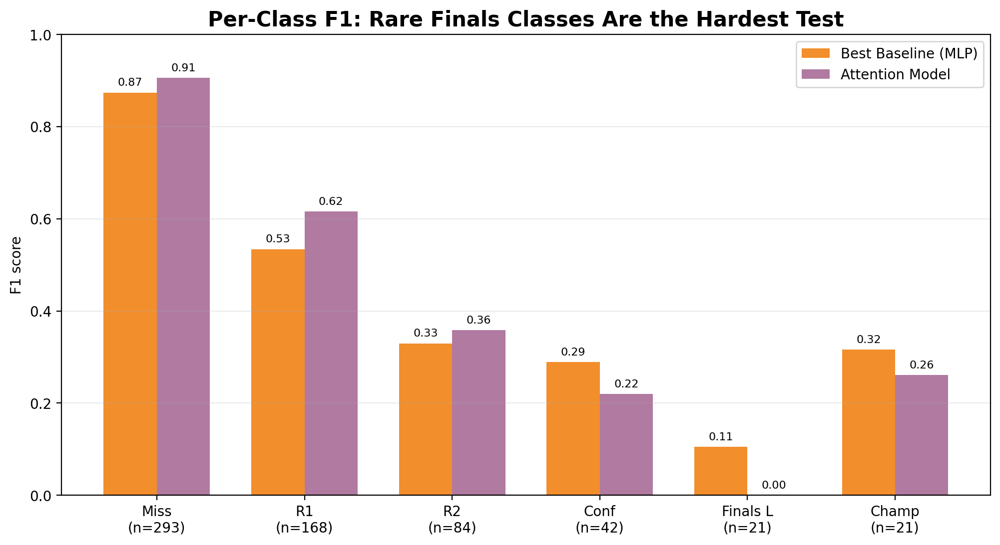

Figure 6. Per-class F1 for the attention model and the best baseline by macro F1. This view makes the rare-class tradeoffs easier to inspect. The figure uses `results/research_study/attention_classification_report.csv` and `results/research_study/best_baseline_classification_report.csv`.

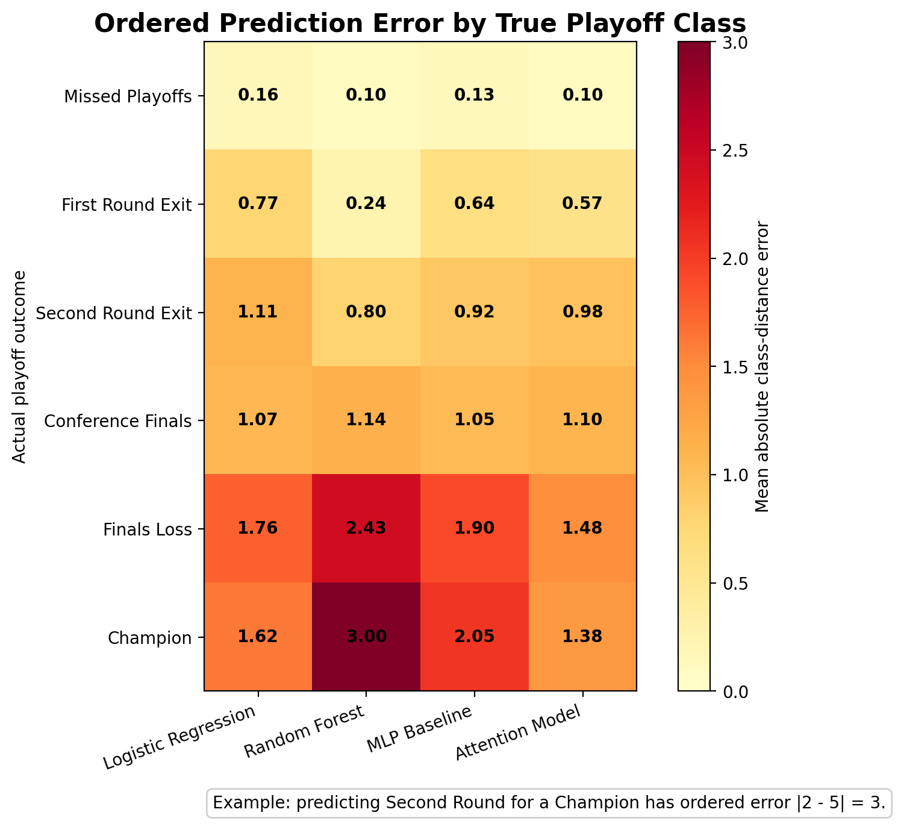

Figure 7. Ordered-label error heatmap for the full-season setting. Instead of treating every mistake as equally distant, the plot shows how far predictions move across the playoff-depth scale.

We also evaluate the mid-season setting. All models lose information when we restrict features to All-Star-break proxy cutoffs, but our results remain meaningful. Random Forest and the Attention Model tie for best exact accuracy at 60.4%. The Attention Model achieves the best macro F1 at 37.1%, and Random Forest achieves the best top-2 accuracy at 81.9%.

| Model | Accuracy | Accuracy Mean +/- SD | Macro F1 | Top-2 Accuracy |
| --- | ---: | ---: | ---: | ---: |
| Logistic Regression | 54.8% | 54.8% +/- 7.7% | 32.4% | 74.1% |
| Random Forest | 60.4% | 60.4% +/- 4.2% | 28.6% | 81.9% |
| MLP Baseline | 57.9% | 57.9% +/- 8.1% | 32.6% | 77.6% |
| Attention Model | 60.4% | 60.4% +/- 9.4% | 37.1% | 80.1% |

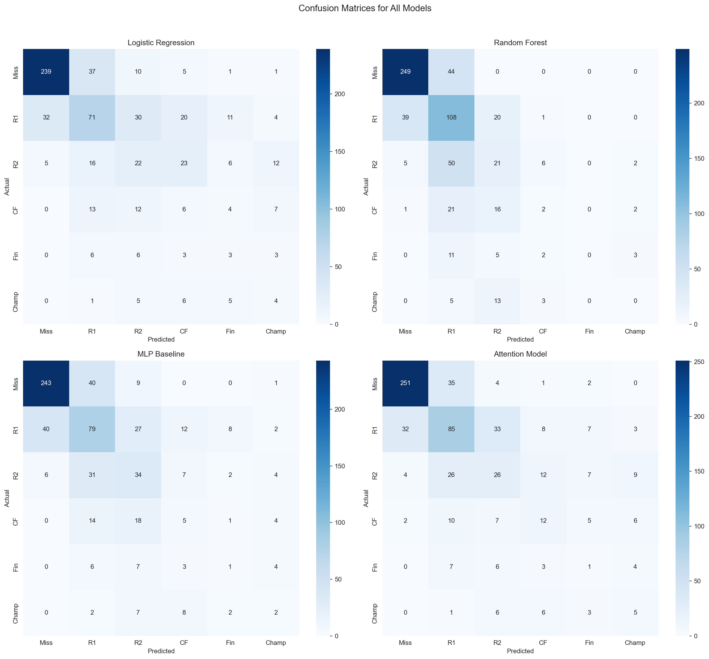

Figure 8. Mid-season confusion matrices. Prediction errors increase when late-season information is removed, but the main class structure remains visible. The matrices use `results/midseason_study/predictions.csv`.

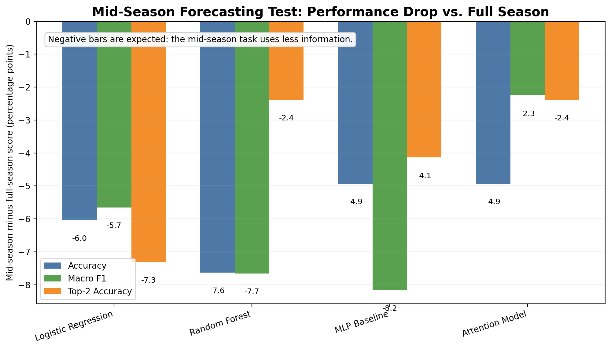

Figure 9. Metric changes from full-season to mid-season forecasting. Every model declines under the shorter feature window, as expected. The comparison uses the full-season and mid-season `model_comparison.csv` files.

The attention model has the smallest macro-F1 drop from full-season to mid-season, falling only 2.3 percentage points from 39.3% to 37.1%. Random Forest loses 7.7 macro-F1 points, Logistic Regression loses 5.7 points, and the MLP baseline loses 8.2 points. Our results suggest that explicit roster structure remains useful when team-level aggregates are noisier earlier in the season.

## Interpretability

We use attention weights to inspect how the model uses the top-eight rotation slots. These weights do not prove causal player value. They show which roster slots the model emphasizes when building the pooled roster representation. In our runs, the first few rotation slots generally receive higher attention, which matches the basketball intuition that high-end talent matters heavily in the playoffs. Later slots still receive nonzero weight, so the model also accounts for depth and balance.

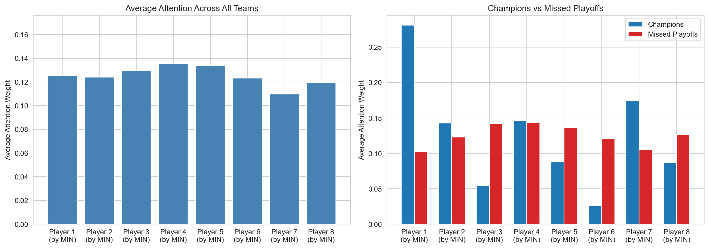

Figure 10. Full-season average attention weights across the top-eight rotation slots. The diagnostic comes from the trained attention model in our full-season study pipeline.

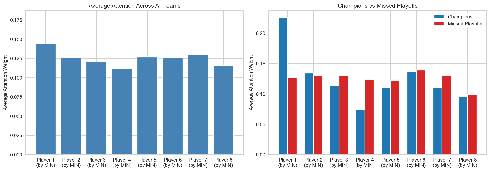

Figure 11. Mid-season attention weights for the same roster slots. This comparison lets us examine roster emphasis before the regular season ends. The plot uses the mid-season artifacts in `results/midseason_study/` and `docs/figures_midseason/`.

We also visualize team-season embeddings with t-SNE. The plots separate missed-playoff teams more clearly than the deepest playoff classes. Champions, Finals teams, and conference finalists overlap heavily. That overlap helps explain why exact rare-class prediction remains difficult even when overall accuracy is respectable.

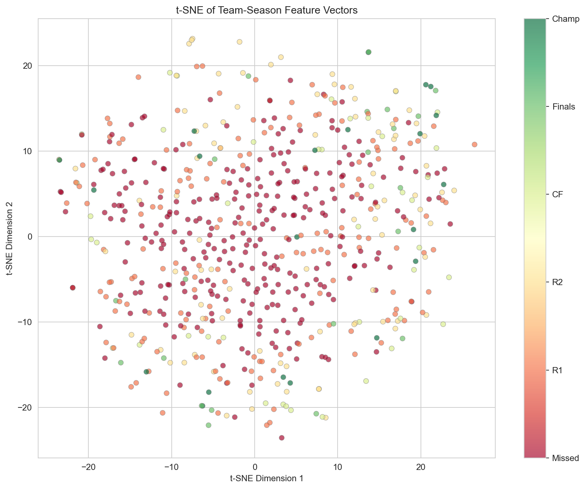

Figure 12. Full-season team-season feature representations projected into two dimensions and colored by playoff-depth label. The visualization comes from the full-season feature matrix and model visualization pipeline.

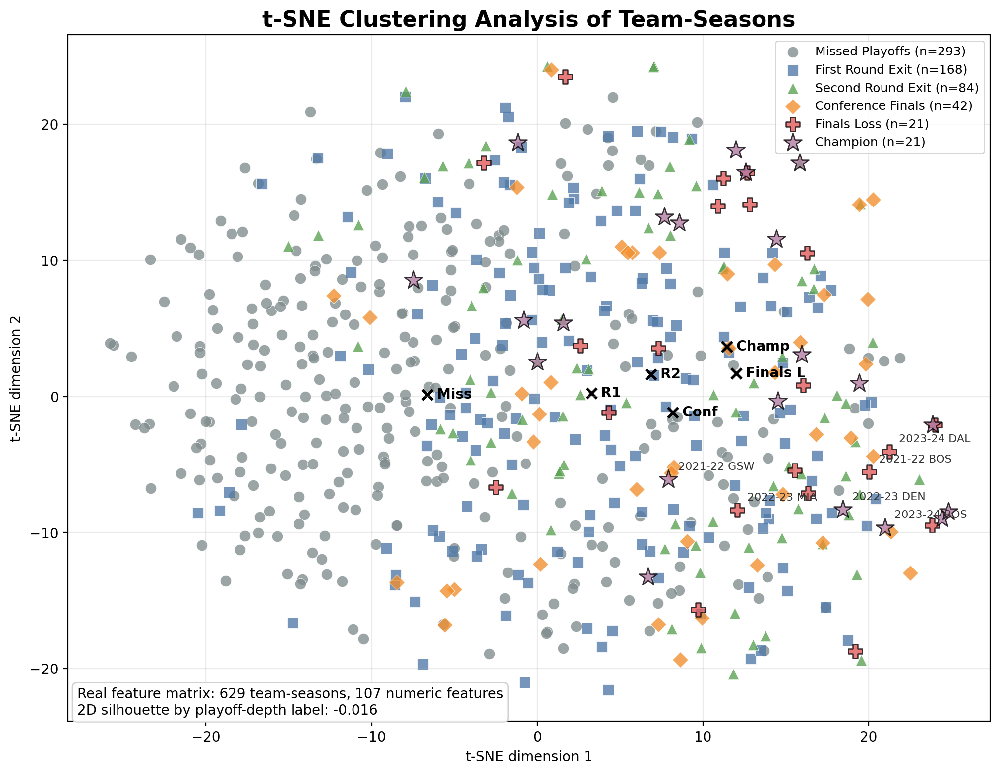

Figure 13. Cluster-oriented view of the full-season t-SNE projection. The plot highlights where playoff-depth groups separate and where they overlap.

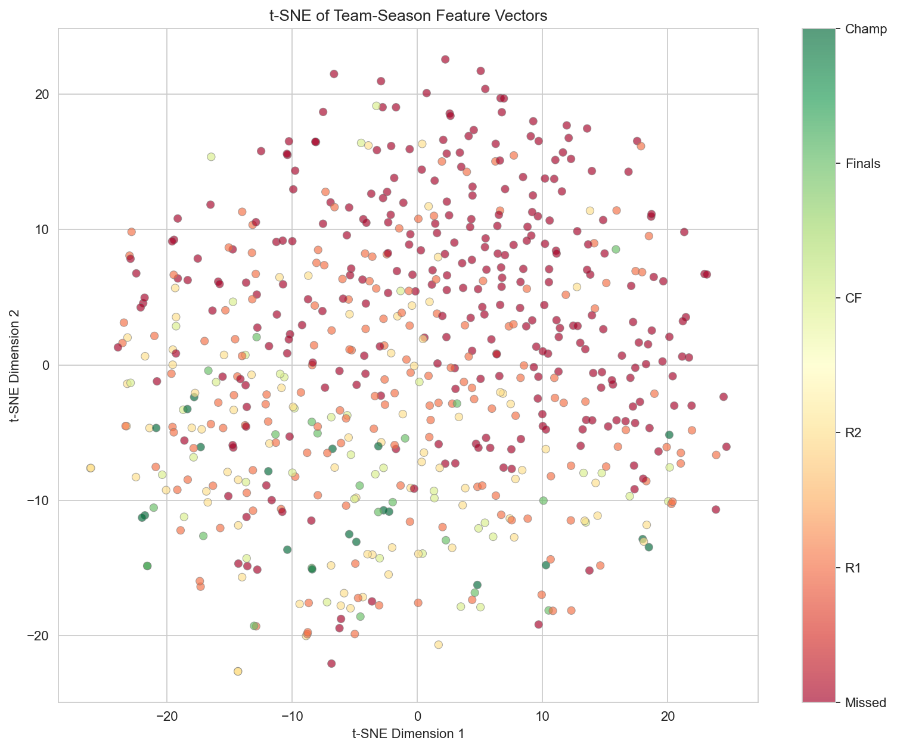

Figure 14. Mid-season team-season features projected into two dimensions. Partial-season data preserves some structure, but overlap among playoff teams increases. The figure uses `data/processed/features_midseason.csv` and the mid-season visualization pipeline.

## Finals And Champion Diagnostics

The Finals Loss and Champion classes each contain only 21 examples, so our project adds dedicated diagnostics for those labels. These figures help us see whether models recognize the deepest playoff teams or simply classify most elite teams into nearby classes. We treat these plots as error analysis, not as evidence that the model can reliably identify champions.

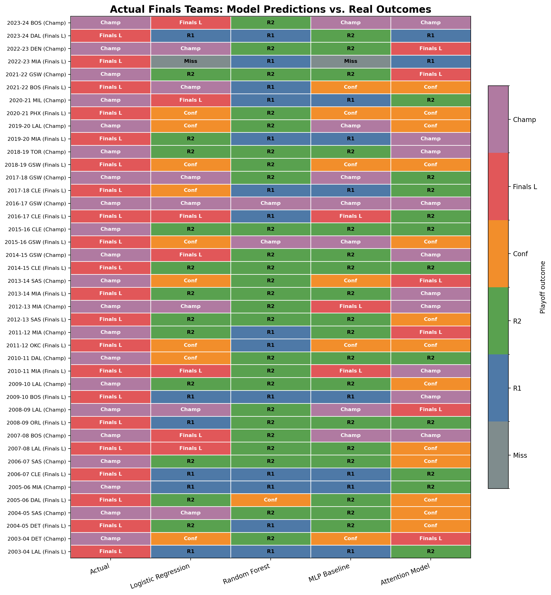

Figure 15. Team-level predictions for NBA Finals participants. The heatmap makes champion and finalist confusion visible across models and uses the full-season out-of-fold predictions.

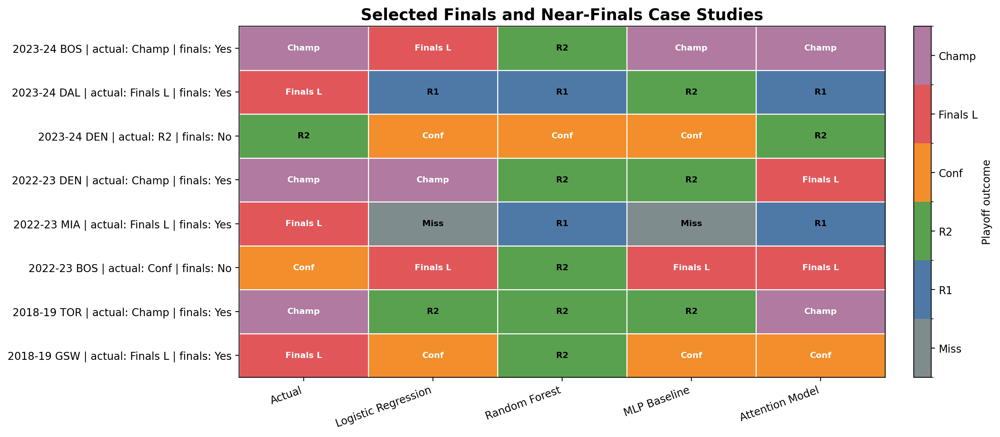

Figure 16. Selected Finals-team prediction cases. These examples help us inspect when models placed elite teams in the correct or adjacent outcome classes. The rows come from `results/research_study/predictions.csv`.

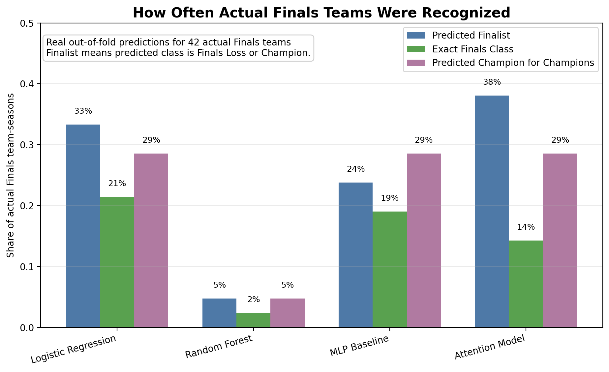

Figure 17. Detection of the deepest playoff outcomes by model. The figure emphasizes the gap between overall accuracy and rare-class recognition in the full-season classification outputs.

## Fairness Audit

Our project includes a coarse market-size fairness audit using the attention model's predictions. We group teams into large-market and small-market buckets, then compare actual mean label, predicted mean label, and average absolute error. This audit does not prove fairness. Market size is only one proxy, and playoff success itself is not evenly distributed across markets. We use it as a sanity check and as a reminder that sports models can absorb structural patterns from the league.

For the full-season setting, large-market teams have average actual label 1.257, average predicted label 1.305, and average absolute error 0.533. Small-market teams have average actual label 0.924, average predicted label 0.988, and average absolute error 0.475. The full-season error gap is 0.058. For the mid-season setting, the large-market error is 0.710, the small-market error is 0.556, and the error gap widens to 0.153.

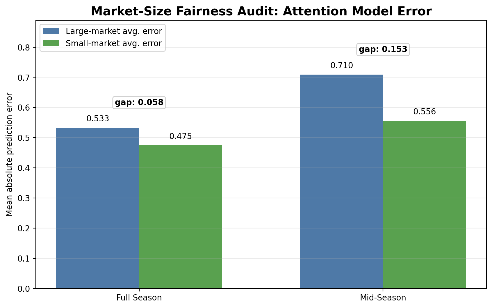

Figure 18. Market-size audit comparing prediction error across large-market and small-market teams. The plot uses the fairness artifacts in `results/research_study/market_fairness.json` and `results/midseason_study/market_fairness.json`.

## Generated Artifacts

Our project generates and commits reproducible artifacts so reviewers can inspect our results without rerunning the full pipeline. The primary full-season artifacts are `results/research_study/model_comparison.csv`, `summary_metrics.json`, `fold_metrics.csv`, `predictions.csv`, `attention_classification_report.csv`, `best_baseline_classification_report.csv`, and `market_fairness.json`. The corresponding mid-season artifacts live in `results/midseason_study/` with the same filenames.

The full-season figures live in `docs/figures/`, and the mid-season figures live in `docs/figures_midseason/`. We can regenerate the additional presentation figures with `.\.venv\Scripts\python.exe scripts\generate_additional_figures.py`. We can reproduce the full research run with `python run_research_study.py --epochs-mlp 150 --epochs-attention 200 --lr 0.001 --seed 42`, and we can reproduce the mid-season run with `python run_midseason_study.py --epochs-mlp 150 --epochs-attention 200 --lr 0.001 --seed 42`.

# Limitations

Our project has several limitations. The dataset is small for a six-class deep learning task because each season contributes only one champion and one Finals loser. Even across 21 seasons, the rarest classes have only 21 examples each. Macro F1 and rare-class diagnostics therefore matter more than headline accuracy.

The feature set summarizes box-score production, advanced efficiency, roster continuity, conference context, and top-eight rotation players. It does not include play-by-play data, tracking data, lineup combinations, salary, injuries, rest, playoff matchup paths, coaching adjustments, or late-series tactical changes. Those missing signals likely explain many errors among champions, finalists, and conference finalists. The mid-season setting also cannot observe later trades, injuries, rotation changes, or late-season form.

Attention weights make the model more interpretable, but they are not causal evidence. They tell us which rotation slots the model used, not which players caused wins or playoff advancement. Analysts should treat the attention plots as model diagnostics rather than player rankings.

The market-size audit is intentionally narrow. We do not encode player demographics, race, nationality, salary, endorsement value, or media popularity, but team-level sports data can still reflect structural inequalities. Our audit compares large-market and small-market errors as a basic check. A full fairness study would require richer variables, stakeholder review, and clearer definitions of harm.

Finally, our project keeps hyperparameter tuning modest to protect reproducibility and reduce overfitting. A larger production study could explore calibrated probabilities, temporal models, matchup-aware playoff simulations, richer player embeddings, imbalance-aware losses, and season-aware oversampling methods inspired by SMOTE [12] and ADASYN [14]. The main finding is measured: regular-season and rotation statistics contain real playoff-depth signal, but they do not reliably identify NBA champions as a distinct class.

## Acknowledgment

We thank the course instructors of Deep Learning at the University of Colorado Denver for their guidance throughout our project. We also acknowledge the `nba_api` project maintainers for providing open access to NBA statistics.

## References

[1] R. Khanmohammadi, S. Saba-Sadiya, S. Esfandiarpour, T. Alhanai, and M. M. Ghassemi, "MambaNet: A hybrid neural network for predicting the NBA playoffs," SN Comput. Sci., vol. 5, no. 5, 2024, doi: 10.1007/s42979-024-02977-0.

[2] K. Zhao, C. Du, and G. Tan, "Enhancing basketball game outcome prediction through fused graph convolutional networks and random forest algorithm," Entropy, vol. 25, no. 5, 2023, doi: 10.3390/e25050765.

[3] W. Guan, N. Javed, and P. Lu, "NBA2Vec: Dense feature representations of NBA players," arXiv:2302.13386, 2023.

[4] Y. Ouyang et al., "Integration of machine learning XGBoost and SHAP models for NBA game outcome prediction," PLoS ONE, vol. 19, no. 7, e0307478, 2024, doi: 10.1371/journal.pone.0307478.

[5] C. Rios, L. Han, A. Baimagambetov, and N. Polatidis, "Long-sequence LSTM modeling for NBA game outcome prediction using a novel multi-season dataset," arXiv:2512.08591, 2025, doi: 10.48550/arXiv.2512.08591.

[6] S. Z. Ibrahim, A. M. Reza, L. W. Kean, N. A. Ab. Aziz, and S. N. M. Sayed Ismail, "Machine learning insights into basketball championship predictions: An analytical comparison," in Lecture Notes in Bioengineering, Springer, 2024, pp. 275-285, doi: 10.1007/978-981-97-3741-3_26.

[7] G. D. S. Teno, C. Wang, N. Carlsson, and P. Lambrix, "Predicting season outcomes for the NBA," in Machine Learning and Data Mining for Sports Analytics, Springer, 2022, pp. 129-142, doi: 10.1007/978-3-031-02044-5_11.

[8] R. P. Bunker and F. Thabtah, "A machine learning framework for sport result prediction," Appl. Comput. Inform., vol. 15, no. 1, pp. 27-33, 2019, doi: 10.1016/j.aci.2017.09.005.

[9] M. Yeung, "Multiple machine learning algorithms-based NBA team playoffs prediction," ITM Web Conf., vol. 70, 04024, 2025, doi: 10.1051/itmconf/20257004024.

[10] J. Perricone, S. Shaw, and J. Swiechowicz, "Predicting results for professional basketball using NBA API data," Stanford Univ., Stanford, CA, USA, Tech. Rep. CS229, 2016.

[11] Y. Wang, W. Liu, and X. Liu, "Explainable AI techniques with application to NBA gameplay prediction," Neurocomputing, vol. 483, pp. 59-71, 2022, doi: 10.1016/j.neucom.2022.01.098.

[12] N. V. Chawla, K. W. Bowyer, L. O. Hall, and W. P. Kegelmeyer, "SMOTE: Synthetic minority over-sampling technique," J. Artif. Intell. Res., vol. 16, pp. 321-357, 2002, doi: 10.1613/jair.953.

[13] D. Elreedy and A. F. Atiya, "A comprehensive analysis of synthetic minority oversampling technique (SMOTE) for handling class imbalance," Inf. Sci., vol. 505, pp. 32-64, 2019, doi: 10.1016/j.ins.2019.07.070.

[14] H. He, Y. Bai, E. A. Garcia, and S. Li, "ADASYN: Adaptive synthetic sampling approach for imbalanced learning," in Proc. IEEE Int. Joint Conf. Neural Networks, 2008, pp. 1322-1328, doi: 10.1109/IJCNN.2008.4633969.

[15] A. Vaswani et al., "Attention is all you need," in Proc. 31st Conf. Neural Inf. Process. Syst., 2017, pp. 5998-6008.

[16] P. Mokha, "nba_api: An API client package to access NBA.com APIs," GitHub repository, 2018. [Online]. Available: https://github.com/swar/nba_api
